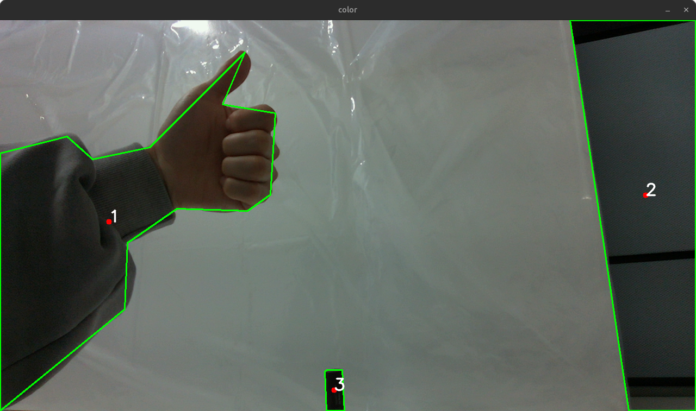

# realsense-object-center

Intel RealSense 카메라를 사용하여 객체의 위치와 깊이를 감지하는 ROS 2 패키지입니다.

## 사용 기술
`ROS2 Humble` `Intel RealSense` `OpenCV` `cv_bridge` `Python3.10`

## 설치

```bash
# 패키지를 클론합니다.
git clone https://github.com/SunoopDogg/realsense-object-center.git

# 필요한 패키지를 설치합니다.
sudo apt update
sudo apt install -y ros-$ROS_DISTRO-cv-bridge python3-opencv

# ROS 2 환경을 설정합니다.
source /opt/ros/$ROS_DISTRO/setup.bash

# 패키지를 빌드합니다.
colcon build
```

## 실행

```bash
# ROS 2 환경을 설정합니다.
source install/setup.bash

# 카메라를 켭니다.
ros2 launch realsense2_camera rs_launch.py config_file:=src/realsense_object_center/camera_params.yaml

# 노드를 실행합니다.
ros2 run realsense_object_center object_center_node
```

## 토픽

### 구독 토픽

- `/camera/color/image_raw` (`sensor_msgs/Image`): 컬러 이미지
- `/camera/aligned_depth_to_color/image_raw` (`sensor_msgs/Image`): 컬러 이미지에 정렬된 깊이 이미지

### 게시 토픽

- `/object_pose_depth_list` (`realsense_object_center_msgs/ObjectPoseDepthList`): 감지된 객체의 위치와 깊이 정보 리스트

## 메시지 정의

### ObjectPoseDepth.msg

객체의 위치와 깊이 정보를 나타내는 메시지입니다.

```plaintext
int32 id    # 객체의 ID (면적이 큰 순서로 정렬됨)
int32 x     # 객체의 x 좌표
int32 y     # 객체의 y 좌표
float32 d   # 객체의 깊이 값
```

### ObjectPoseDepthList.msg

여러 객체의 위치와 깊이 정보를 포함하는 메시지 리스트입니다.

```plaintext
realsense_object_center_msgs/ObjectPoseDepth[] objects
```

## 예시

아래는 객체 감지 결과의 예시입니다.


```plaintext
[INFO] [1739805106.790156680] [object_pose_depth_subscriber]: Object ID: 1, X: 204, Y: 359, Depth: 0.0
[INFO] [1739805106.790414169] [object_pose_depth_subscriber]: Object ID: 2, X: 1188, Y: 322, Depth: 587.0
[INFO] [1739805106.790670637] [object_pose_depth_subscriber]: Object ID: 3, X: 582, Y: 673, Depth: 538.0
```